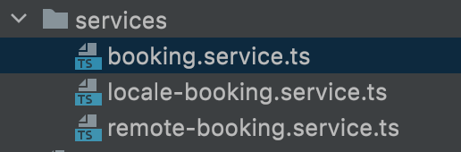
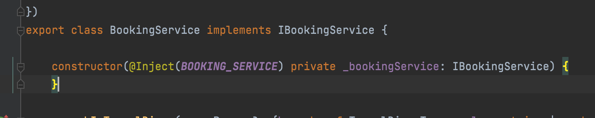

# FuelManager

This project was generated with [Angular CLI](https://github.com/angular/angular-cli) version 13.2.1.

## Small description

This current project is a simple hobby project for practicing simple or in-depth functionalities within logical functinalities implementation.

Used technology-features

<table>
    <thead>
        <tr>
            <th>Used "Features"</th>
            <th>Comment</th>
        </tr>
    </thead>
    <tbody>
        <tr>
            <td>Lazy-loaded module handlings</td>
            <td>I've used multiple different modules, handling everything at it's best unit. Routing and loading of modules are handled in lazy way so it show a bit of a performance difference compared to not-lazy form. Also handled translation issues that are common in using lazyloaded modules</td>
        </tr>
        <tr>
            <td>Using a separated common module for handling package-like common data like components, services, interfaces, etc. (things that could be exported as a package)</td>
            <td></td>
        </tr>
        <tr>
            <td>Custom ControlValueAccessor implementations with multiple generic parent classes used to create ValueAccessor components with ease</td>
            <td></td>
        </tr>
        <tr>
            <td>Custom (sometimes generic) Injection token usages on different interfaces</td>
            <td>
                It's a tricky one. With implementing Local and Remote usage of the application, I've integrated 3 different services for handling them. The implementation of these services is simple, its handled across Injection tokens so there is no need to implement every service (local and remote) at a time. Just the "collector" serivce of them is enough
            </td>
        </tr>
        <tr>
            <td>Multiple, different but similar services used by handling the implementations of them across custom interfaces and Injection tokens. Handled inside module with provider and checked across <b>factory</b></td>
            <td></td>
        </tr>    
        <tr>
            <td>Firebase authentication and authorization</td>
            <td></td>
        </tr>
        <tr>
            <td>Firebase realtime database for storing data</td>
            <td>This may look like a bit overkill. Sure, realtime database is not meant for that, but basically, the case was not to use something thats the best practie in these cases, but to try out reactivity in-out using realtime async functinality</td>
        </tr>
    </tbody>
</table>

###Example for the mentioned generic Injection Token - Service usage for Locale/Remote handling

## Development server

Run `ng serve` for a dev server. Navigate to `http://localhost:4200/`. The app will automatically reload if you change any of the source files.

## Build

Run `ng build` to build the project. The build artifacts will be stored in the `dist/` directory.

<table>
    <thead>
        <tr>
            <th></th>
            <th>Simple</th>
            <th>Prod</th>
        </tr>
    </thead>
    <tbody>
        <tr>
            <td>Build command</td>
            <td>`ng build` or `npm run build`</td>
            <td>npm run build:prod</td>
        </tr>
        <tr>
            <td>Description</td>
            <td>Creates a simple build, probably with prod mode because its currently the default</td>
            <td>Custom script for creating a production build, with a combined "updateBuild" script execution, that inserts a timestamp of the build into the environment</td>
        </tr>
    </tbody>
</table>
